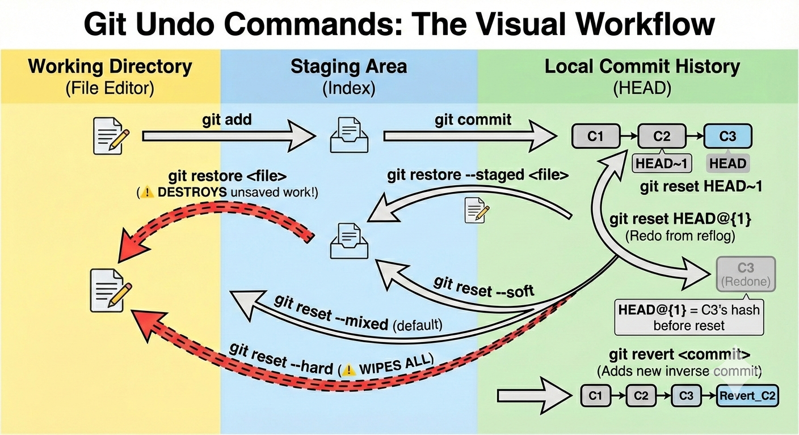

## Understanding `git reset`: Flags and Behaviors

In Git, the `git reset` command allows you to undo commits by moving the `HEAD` pointer. The primary differences between its three main flags—`--soft`, `--mixed` (default), and `--hard`—lie in how they affect the staging area and working directory.

### The Three Modes of Reset

* **`--soft`**: Moves `HEAD` to a specific commit but keeps all changes staged (ready to commit). Your files remain in the staging area.
* **`--mixed` (Default)**: Moves `HEAD` to a specific commit and unstages all changes, but keeps the file modifications intact in your working directory.
* **`--hard`**: Moves `HEAD` to a specific commit, destroys all changes in the staging area, and entirely discards all modifications in the working directory. *Note: This is destructive and generally cannot be undone.*

### Differences Between Reset Modes

| Mode | Moves HEAD? | Updates Staging Area (Index)? | Updates Working Directory? | Safety Level |
| --- | --- | --- | --- | --- |
| **`--soft`** | Yes | No | No | **Safe:** Changes are kept staged. |
| **`--mixed`** | Yes | Yes | No | **Default:** Changes are kept but unstaged. |
| **`--hard`** | Yes | Yes | Yes | **Dangerous:** Discards all uncommitted changes. |

---

## `git reset` vs. `git restore`

While `git reset` is primarily used to update your branch by moving the branch tip to a different commit (which modifies the project's commit history), `git restore` serves a different purpose. `git restore` is used strictly for restoring files in the working directory or staging area to a previous state, and it does not affect the overall commit history.

### Key Differences

| Feature | `git reset` | `git restore` |
| --- | --- | --- |
| **Primary Use** | Move the branch pointer (`HEAD`) to a different commit. | Restore files in the working tree or staging area. |
| **History** | Modifies commit history (if used to move `HEAD`). | Does not modify commit history. |
| **Scope** | Can operate on commits (e.g., `git reset HEAD~1`) or individual files (`git reset <file>`). | Operates on individual files or directories only. |
| **Safety** | Can be destructive, especially with `--hard` or on shared branches. | Generally safer for local changes to files, as it won't affect committed history. |
| **Introduction** | An older command, present from Git's early days. | A newer command (Git 2.23+, August 2019) introduced to separate concerns from `git reset` and `git checkout`. |

---

Git panic is a universal developer experience, but mastering these commands transforms Git from a scary black box into a forgiving time machine.

Before we jump into scenarios, the most important step in *any* of these workflows is understanding where you currently are. This is where `git log --oneline` comes in. It gives you a clean, compressed view of your recent history, providing the exact commit hashes (the 7-character IDs like `a1b2c3d`) you need to target.

Here is how you should think about and approach real-world situations for each mode.

## Scenario 1: The "I forgot a file" (`--soft`)

**The Mindset:** You just typed `git commit -m "Add user authentication"`, hit enter, and immediately realized you forgot to stage the `auth_config.js` file. Or, you realize your commit message was completely wrong. You want to undo the commit itself, but you want all the work you just did to stay exactly where it is, ready to be committed again.

**The Steps:**

1. **Find where to go back to:** Run `git log --oneline` to see your current commit and the one before it. Let's say the commit before your mistake is `8f7b5a1`.
2. **Move HEAD, keep the stage:** Run `git reset --soft 8f7b5a1`. Alternatively, if it was just the very last commit, you can use `git reset --soft HEAD~1` (which means "go back one commit").
3. **Fix the mistake:** Your previous changes are still staged. Now, simply run `git add auth_config.js`.
4. **Recommit:** Run `git commit -m "Add user authentication and config"` to create the perfect commit.

## Scenario 2: The "Let's break this up" (`--mixed`)

**The Mindset:** You got into a flow state and coded for 4 hours. You built a new feature, fixed an unrelated bug, and reformatted a CSS file. You ran `git commit -a -m "Did a bunch of stuff"`. This is bad practice. You want to undo that massive commit and break it down into three clean, logical commits, but you *don't* want to lose any of the code you wrote.

**The Steps:**

1. **Find where to go back to:** Run `git log --oneline` and find the commit *before* your massive "bunch of stuff" commit. Let's say it's `c4d3e2f`.
2. **Move HEAD, unstage everything:** Run `git reset --mixed c4d3e2f` (or just `git reset c4d3e2f` since `--mixed` is the default).
3. **Re-stage strategically:** All your modified files are now sitting safely in your working directory, unstaged.
4. **Create clean commits:**
* `git add styles.css` -> `git commit -m "Refactor CSS formatting"`
* `git add bugfix.js` -> `git commit -m "Fix navigation bug"`
* `git add feature/` -> `git commit -m "Implement new user dashboard"`

## Scenario 3: The "Burn it with fire" (`--hard`)

**The Mindset:** You've been experimenting with a new library for the last three commits. It's a complete disaster. The code is broken, the tests are failing, and you just want to pretend the last hour never happened. You want to nuke the commits, the staging area, and the working directory entirely.

**The Steps:**

1. **Find the last good state:** Run `git log --oneline` and locate the last commit where your code was actually working. Let's say it's `9a8b7c6`.
2. **Nuke the changes:** Run `git reset --hard 9a8b7c6`.
3. **Breathe:** Your project is now an exact, clean clone of how it looked at `9a8b7c6`. All experimental code is gone. *(Warning: Uncommitted changes are permanently deleted here).*

---

## Scenario 4: The Rescue Operation (`git reflog`)

**The Mindset:** Absolute panic. You just ran `git reset --hard` but you copied the wrong commit hash. You just deleted hours of good work instead of the bad work. `git log` doesn't show your deleted commits anymore.

**The Steps:**

1. **Look at the ghost history:** Run `git reflog`. While `git log` shows the history of your current branch, `git reflog` shows a chronological history of *every single time the HEAD pointer moved in your local repository*, regardless of branch or resets.
2. **Find the moment before disaster:** You will see a list of actions like `HEAD@{0}: reset: moving to...` and `HEAD@{1}: commit: Adding awesome feature`. Look for the state you were in right *before* you did the bad reset.
3. **Time travel:** Let's say `HEAD@{1}` (or its associated hash, e.g., `e5f6g7h`) was your last good state. Run `git reset --hard e5f6g7h` (or `git reset --hard HEAD@{1}`).
4. **Celebrate:** Your lost commits and code are magically restored.

---
