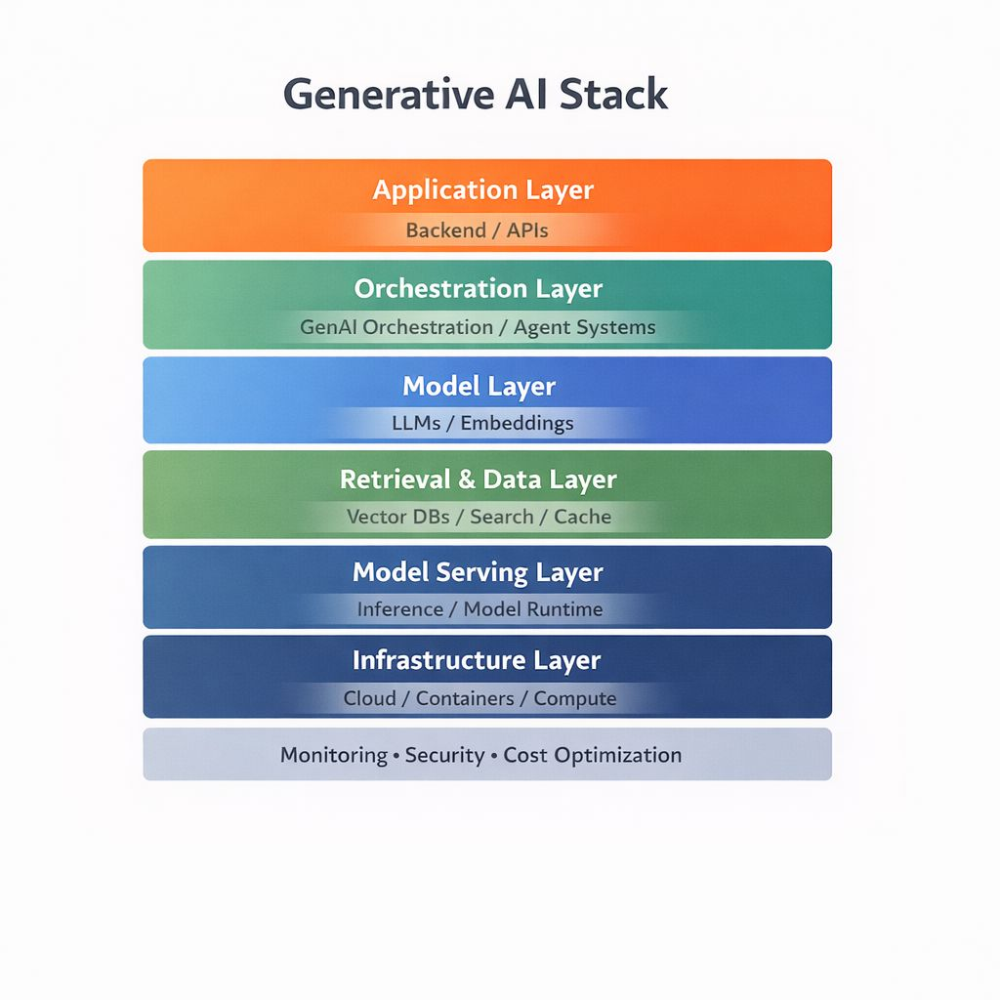

### فخ الحلول "المثيرة": لماذا الـ AI ليس بديلاً لهندسة البرمجيات؟

في ناس كتير في مجال الـ AI رافضين يلمسوا أي حاجة مش AI... **وهذا غير صحيح.**

لو عندك Database ومحتاج تعمل Retrieval، هل أول حاجة هتعملها إنك ترمي Prompt على Model؟
ولا هتفكر الأول في الأساسيات الهندسية:

* بناء **Indexing** سليم.
* عمل **Query Optimization**.
* استخدام الـ **Caching**.
* واختيار الـ **Retrieval Strategy** المناسبة؟

لو عندك Model محتاج تعمله Deploy على الـ Cloud، هل هتسأل عن Prompt Engineering؟
ولا هتفكر في الهيكلة والتشغيل:

* التعامل مع الـ **Concurrency**.
* اختيار أفضل **LLM Hosting Solution**.
* تقليل الـ **Latency**.
* وحساب الـ **Cost**؟

> **"الـ AI مش بديل للـ Engineering. هو Layer فوقها."**

بشوف حلول كتير بتستخدم AI بشكل مبالغ فيه، مش لأنه الحل الأفضل هندسياً، لكن لأنه الحل "المثير".

مؤخراً، وأنا براجع شغل من التيم، لقيت جزء كامل معمول باستخدام AI، رغم إن المشكلة كانت ممكن تتحل بـ **Pure Engineering**.
بالفعل، عدلنا الجزء ده، وكانت النتيجة:

* 📉 **عدد Tokens أقل.**
* ⚡ **Latency أقل.**
* 💰 **التكلفة (Cost) قلت بحوالي 15%.**

النسبة لوحدها قد لا تبدو ضخمة، لكن Optimization هنا، و Optimization هناك... بيعمل فرق كبير جداً على الـ **Scale**.

### تطور المجال

الحقيقة إن مجال الـ AI دلوقتي بقى له Stack كامل.
زي ما كان فيه Full Stack Developer... دلوقتي السوق محتاج **Full Stack AI Engineer**.

